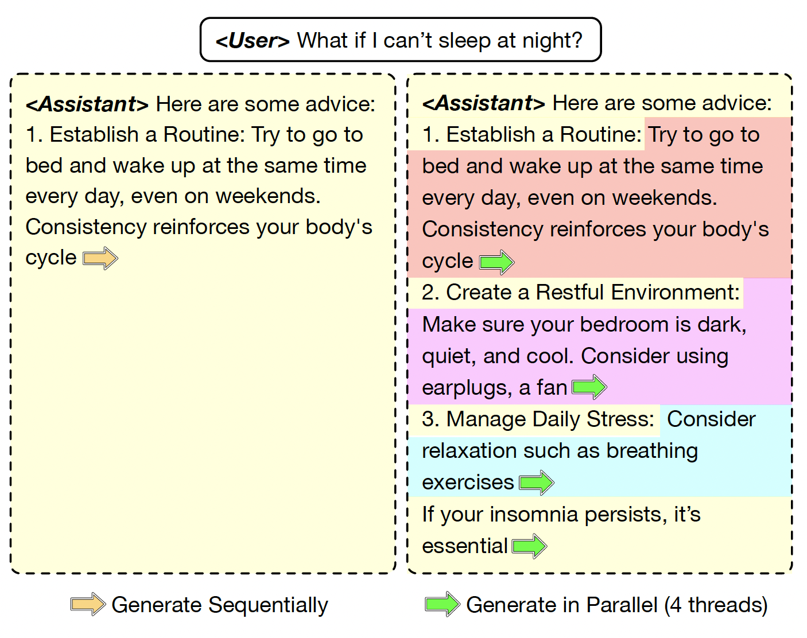

# APAR: LLMs Can Do Auto-Parallel Auto-Regressive Decoding

<center>
<p>
<a href="https://arxiv.org/abs/2401.06761" target="_blank">[📃Paper]</a>
</p>
</center>

> The massive adoption of large language models (LLMs) demands efficient deployment strategies. However, the auto-regressive decoding process, which is fundamental to how most LLMs generate text, poses challenges to achieve efficient serving. In this work, we introduce a parallel auto-regressive generation method. By instruct-tuning on general domain data that contains hierarchical structures, we enable LLMs to independently plan their generation process and perform auto-parallel auto-regressive (APAR) generation, significantly reducing the number of generation steps. APAR alone can achieve up to 2x speed-up, and when combined with speculative decoding, the speed-up can reach up to 4x. In addition, APAR reduces the key-value cache consumption and attention computation during generation. This leads to a throughput increase of 20-70% and a latency reduce of 20-35% in high-throughput scenarios, compared to state-of-the-art serving frameworks.

<center>
<p>

</p>
</center>

## Data

Data pre-processing scripts and processed datasets are included in `/data`.
- `apar.json` the training input as structured data
- `apar_flatten.json` the training input as structured data (in sequential format, used for training Medusa heads)
- `unstructured.json` the training input as unstructured data
- `apar_testset.json` the apar test set used for evaluation
- `*.py` pre-processing scripts
- `[Fork]` token is represented as `[SplitMask]` and `[Child]` token as `[SplitSop]` in the origin data and model special tokens.


## APAR Models

Trained APAR model checkpoints are included in the following repo.

- 🤗 APRA-7B: https://huggingface.co/THUDM/apar-7b

- 🤗 APAR-13B: https://huggingface.co/THUDM/apar-13b

Their corresponding Medusa heads are included in the `medusa` directory of the repo.

## Training

- `fastchat`: the training code for APAR models
    - Install: `pip install -e fastchat`
    - Training scripts for APAR models: `fastchat/train_scripts/`
- `medusa`: the training code for Medusa heads
    - Install `fastchat` first, and then `pip install -e medusa`
    - Training scripts for the Medusa heads: `medusa/train_scripts/`


## Evaluation

- Vanilla-APAR / Medusa-APAR
    Vanilla-APAR / Medusa-APAR is served using `fastchat`, which should be installed before running the scripts. Medusa-APAR also needs `medusa` installed.

    **Start controller and model worker.**

    ```bash
    cd fastchat

    # controller
    python -m fastchat.serve.controller --port 21001

    # Vanilla model worker
    CUDA_VISIBLE_DEVICES=0 python -m fastchat.serve.model_worker \
        --model-path <path to the model checkpoint> \
        --apar \
        --controller-address http://127.0.0.1:21001

    # Medusa model worker
    CUDA_VISIBLE_DEVICES=0 python -m fastchat.serve.medusa_model_worker \
        --medusa-heads <path to medusa heads> \
        --model-path <path to the model checkpoint> \
        --apar \
        --controller-address http://127.0.0.1:21001
    ```

    **Get traces for analysis.** A trace contains the generation status for each generation step.

    ```bash
    cd fastchat

    python -m fastchat.serve.get_trace \
        --controller http://127.0.0.1:21001 \
        --model <the name registered in controller> \
        --dataset <vicuna_bench | mt_bench> \
        --max-length 2048 \
        --save-path <path to save the results>
    ```

    **Run Gradio UI.**  Gradio UI is only available for Vanilla-APAR.

    ```bash
    cd fastchat

    python -m fastchat.serve.gradio_web_server \
        --controller-url http://127.0.0.1:21001 \
        --port 7860
    ```


- Batched-APAR

    Batched-APAR is implemented with `vllm`. Install vllm with  `pip install -e vllm`

    After installation, run
    ```bash
    cd vllm

    WATERMARK=0.1 MAX_NUM_REQS=350 python test_serving.py --model "path/to/model/checkpoint"
    ```

    where `WATERMARK` is used to control the unused memory and `MAX_NUM_REQS` is used to control the max number of running requests. Generation results and engine logs are save to `vllm_results` by default.

---

If you find our work useful, please consider citing APAR:

```tex
@misc{liu2024aparllmsautoparallelautoregressive,
      title={APAR: LLMs Can Do Auto-Parallel Auto-Regressive Decoding}, 
      author={Mingdao Liu and Aohan Zeng and Bowen Wang and Peng Zhang and Jie Tang and Yuxiao Dong},
      year={2024},
      eprint={2401.06761},
      archivePrefix={arXiv},
      primaryClass={cs.CL},
      url={https://arxiv.org/abs/2401.06761}, 
}
```
